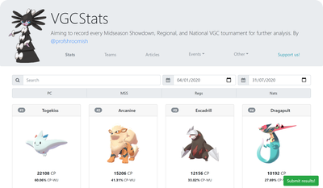

#  VGCStats

A website that gathers statistics about official tournaments of the Pokémon Videogame Championship. 

**This project is now archived. Thank you for all your support!**

## About 

CP (Championship Points) are points awarded to players based on their finish position or placement at official events. Players need to earn a certain amount of CP to qualify to the World Championship. 

VGCStats tracks which Pokémon have been used on official tournaments, how many CP they have earned through the season, and what is their weighted usage (a player can use 6 Pokémon on their team per tournament). It also keeps track of player standings in official events, as well as the team used on those tournaments.

This site aims to help players understand the current state of the metagame. By knowing the CP earned by every Pokémon, a player can see not only which are the most used Pokémon, but also which are performing the best under the current ruleset.

VGCStats began as the [VGCStats twitter account](https://twitter.com/vgcstats), an account made by @ProfShroomish to gather official torunaments results directly from the players, as those are not available in any official way.

## How it works?

All the Pokémon, tournaments, and player's data is hosted on a Google Drive Spreadsheet, no further backend is used. The data is fetched by the site, then presented, organized, and filtered using [Vue](https://vuejs.org/). All ETL is done client-side using ES6 array functions. Images are borrowed from [Serebii](https://www.serebii.net/). The site is currently hosted in github pages.

## What's next?

VGCStats is a live project, with features and changes being delivered week after week. As the season evolves the metagame changes, so we try to keep the site relevant adding features to keep helping the players.

If you would like to contribute, please follow our contributing guidelines:

1. File an issue to notify us about what you're working on.
2. Fork the repo, develop your code changes.
3. Make sure that your commit messages clearly describe the changes.
4. Send a pull request.

## Legal
Pokémon And All Respective Names are Trademark & © of Nintendo.